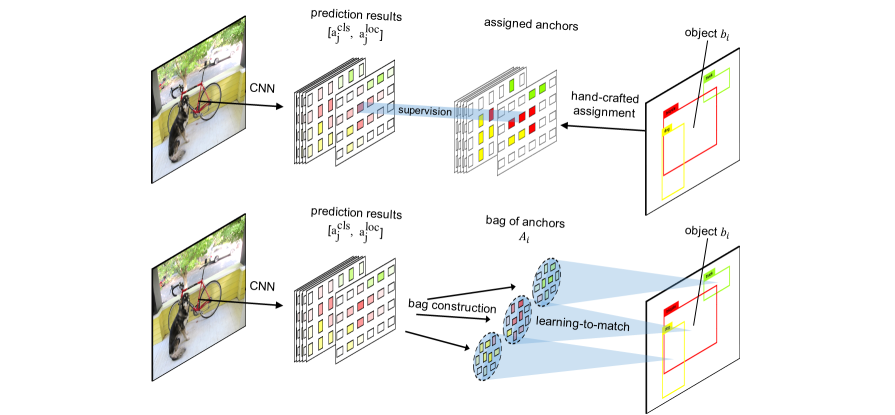

#  FreeAnchor_TensorFlow

### 1. Introduction

This is my implementation of FreeAnchor in pure TensorFlow. The original model is based on maskrcnn-benchmark.
According to the paper ["FreeAnchor: Learning to Match Anchors for Visual Object Detection"](https://arxiv.org/abs/1909.02466).



### 2. Requirements

- python >= 3.5
- tensorflow-gpu >= 1.12.0
- pycocotools (if you want to train and eval on cocodataset)
- torchvision
- tqdm

### 3. Quick start on CocoDataset

- Download [CocoDataset](http://cocodataset.org/#home).
- Change the coco annotation. Change the directory in change_coo_data.py to your cocodataset path, and then run it.

```shell
python change_coo_data.py
```

- For training, just run the train.py file, the model will be saved in ./weight floder

```shell
python train.py
```

- For evaluating, I transfer the free_anchor_R-50-FPN_1x_8gpus.pth weights to tensorflow, you can [download](https://pan.baidu.com/s/1Ck7J4Y85f0ZwGGE672ECNQ&shfl=sharepset) it and place it in ./weight floder. Then run the test.py file.

```shell
python test.py
```

### 4.Reference

```
@inproceedings{zhang2019freeanchor,
  title   =  {{FreeAnchor}: Learning to Match Anchors for Visual Object Detection},
  author  =  {Zhang, Xiaosong and Wan, Fang and Liu, Chang and Ji, Rongrong and Ye, Qixiang},
  booktitle =  {Neural Information Processing Systems},
  year    =  {2019}
}
```
